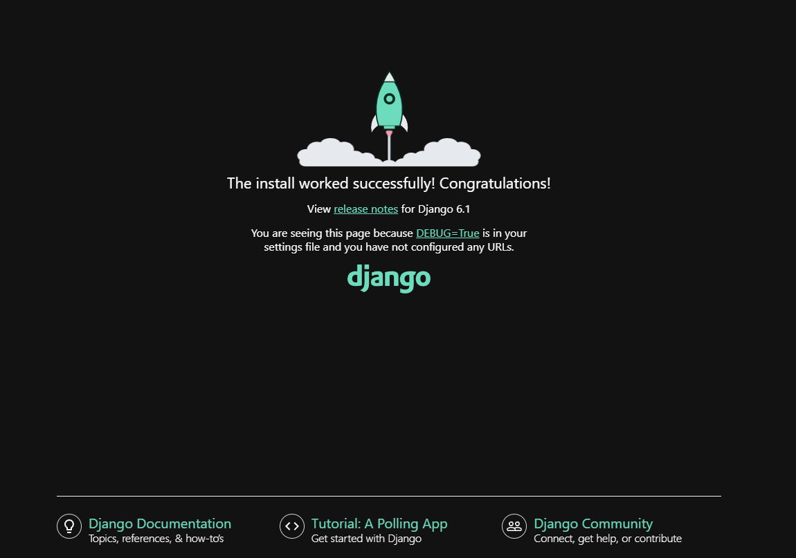

# Flask_Django_FastAPI

TDD création d'un site web (MVC).

# Django (\Flask_Django_FastAPI\DJANGO)

## Prerequis

* Installer `Python` et `Django`
* Vérifications:

```shell
python --version
#Python 3.14.4
python
>>> import django
>>> print(django.get_version())
#6.1.1
```

## installation projet

* Création environnement virtuel `.env`

```shell
python -m venv .env
```

* Puis `sourcer` l'environnement virtuel

```shell
source .env/Scripts/activate
#(.env)
```

* Vérification de la `version` python utilisée par le projet

```shell
which python
# /c/Users/ruffi/WORKSPACE/Flask_Django_FastAPI/.env/Scripts/python
```

* `Activation de Django` dans le projet

```shell
source .env/Scripts/activate
python.exe -m pip install --upgrade pip
pip install django==6.1.1
# Verification
#python -m django --version
#6.1.1
```

* Création du fichier de configuration `requirements.txt` pour figer les dependances

```shell
source .env/Scripts/activate
pip freeze > requirements.txt
# Verification
#python -m django --version
#6.1.1
```

* Dans le cas d'un premier démarrage, apres un clone, il suffit d'éxécuter les commandes suivantes afin de re-télécharger les dependances
  
```shell
python -m venv .env
source .env/Scripts/activate
pip install -r requirements.txt
```

* Pièges :
  * Toujours source votre projet `source .env/Scripts/activate`
  * La configuration python et django se trouve dans le fichier `activate`

## Création projet django (DocBlog)

```shell
#django-admin startproject <Project name>
django-admin startproject DocBlog
#help django
django-admin help
```

### Structure du projet django

```shell
$ tree
.
|-- DocBlog
|   |-- __init__.py
|   |-- asgi.py
|   |-- settings.py
|   |-- urls.py
|   `-- wsgi.py
`-- manage.py
```

* `manage.py` permet d'executer d'autre commandes python
* `DocBlog/urls.py` permet de définir les chemins des urls qui seront redirigés vers les vues.
* `DocBlog/settings.py` définie toutes les preferences de notre application (logger, template, database ...) équivalent applciation.properties en maven.

### Execution du serveur de développement (local hors production)

```shell
cd src
python manage.py migrate
python manage.py runserver
# http://127.0.0.1:8000
# Ctrl + C pour stopper le server
```



### Créer un chemin d'url pour afficher une vue dans notre projet

Exemple création d'une route retourrnant la vue pour une erreur 500

```py
# fichier urls.py
from django.views.defaults import server_error

urlpatterns = [
    path('bonjour/', server_error),
]
# affiche a l'url http://127.0.0.1:8000/bonjour/
# Server Error (500)
```

### Le paramètre append_slash

Parmètrage de la variable d'environnement `append_slash`, intêret sur la résolution des chemins d'urls avec Django.
Cela permet de faire le routage sur des urls contenant ou non le `/` de fin par default à `True`.
Par default, si le `/` de fin de chemin d'url est absent alors lors de l'appel de la route, par exemple `/test` sera redirigé vers `/test/`, append_slash ajoute un `/` à la fin de la route mais génére deux requetes une sur `/test` puis redirection vers `/test/`.
Le passer à `False`, `APPEND_SLASH = False` dans `settings.py`, cela permettra de nous retourner une erreur 404 sans redirection sur l'url avec le `/` de fin.

## Création d'une vue pour une url donnée

* Création d'une vue `[index.view.py](DJANGO/src/DocBlog/index.view.py)`
* Ajout fonction qui nous retourne une  `HttpResponse from django.http import HttpResponse`

```py
# view.py
from django.http import HttpResponse

def index(request):
    return HttpResponse("<h1>Bonjour, bienvenue sur mn site</h1>")
# urls.py
from view import index
urlpatterns = [
    path('', index, name="index"),
]
```

### Création de templates html

* Créer un dossier `templates`, (DJANGO\src\DocBlog\templates)
* Ajouter votre dossier template dans vos settings `settings.py`
* Ajouter un fichier `index.html` au dossier `templates`
* Ajouter le contenu du fichier `index.html`
* ré-écrire votre fonction index de `index.view.py`
  
```py
# settings.py
TEMPLATES = [
    {
        'DIRS': [
            os.path.join(BASE_DIR, "DocBlog/templates")
        ],
    },
]
# index.view.py
from django.shortcuts import render
def index(request):
    return render(request, "index.html")

```

### Insérer des données dans un template

1. Cas de données hard code:
   1. ajouter `context={clé: valeur}`, pour definir un catalogue de données dans `index.view.py`.
   2. dans `index.html`, récupérer la donnée à l'aide des `{{}}`.
   3. possibilité d'ajouter un `|` pour faire un traitement sur le resultat (équivalent pipe Angular)

```py
# index.view.py
from django.shortcuts import render
def index(request):
    return render(request, "index.html", context={"prenom": "Jean-Yves"})
```

```html
<!--index.html-->
    <h1>Bonjour {{ prenom | upper}}, bienvenu sur mon site DJANGO</h1>
    <h2>Nous sommes le {{ date|date:"d F Y H:i:s"}}</h2>
```

* Ressources :
[Django template filter](https://docs.djangoproject.com/en/6.1/ref/templates/builtins/#built-in-filter-reference)
[Code language](http://www.i18nguy.com/unicode/language-identifiers.html)

## Création d'une application (blog) au sein d'un projet (DocBlog), equivalent à un package dans d'autre language

* Création d'une app
  
```shell
cd src
#python manage.py startapp <NAME_APP>
python manage.py startapp blog
```

```shell
.
|-- __init__.py
|-- __pycache__
|   |-- __init__.cpython-314.pyc
|   |-- admin.cpython-314.pyc
|   |-- apps.cpython-314.pyc
|   |-- models.cpython-314.pyc
|   |-- urls.cpython-314.pyc
|   `-- views.cpython-314.pyc
|-- admin.py===================================> fichier pour enregistrer les modèles dans l'interface d'administration.
|-- apps.py====================================>fichier pour définir des configurations de l'application.
|-- migrations=================================> dossier qui contient les fichiers de migrations des modèles.
|   |-- __init__.py
|   `-- __pycache__
|       `-- __init__.cpython-314.pyc
|-- models.py=================================> fichier dans lequel on crée les modèles de l'application
|-- templates
|   `-- blog
|       |-- article_01.html
|       |-- article_02.html
|       |-- article_03.html
|       |-- article_not_found.html
|       `-- index.html
|-- tests.py =================================>fichier pour créer les tests unitaires de l'application.
`-- views.py =================================>fichier pour crées les vues de l'application.
```

* Déclarer cette application dans le fichier `DocBlog/settings.py`

```py
#DocBlog/settings.py
INSTALLED_APPS= [
    'blog',
]
```

### Définir les urls des applications (blog)

* Création d'une vue simple `DJANGO\src\blog\views.py`
* Création du fichier `blog/urls.py`
* Modification des roots de `DocBlog\urls.py` à l'aide d'`include`

```py
#\src\blog\views.py
from django.http import HttpResponse
def index(request):
    return HttpResponse("<h1>Le Blog</h1>")

#\src\blog\urls.py
from django.contrib import admin
from django.urls import path
from .views import index

urlpatterns = [
    path("", index, name="blog-index"),
]

#src\DocBlog\urls.py
from django.urls import include, path
from .index_view import index

urlpatterns = [
    path('blog/', include("blog.urls")),
]
```

* Vérifier que l'url réponds bien : [blog](http://localhost:8000/blog/)

### Utilisation template dans les applications du projet

* Modifier `blog\views` pour remplacer le HttResponse par un render django
* Creation du template `blog\template\index.html` appelé par la précedente view
* Afin d'éviter d'éventuelle conflit entre les noms des templates, créer des sous dossiers à templates, puis mettre à jours vos fichier views en consequences.

```py
#\blog\views.py
from django.shortcuts import render
def index(request):
    return render(request, "blog/index.html")
```

```html
<!--blog\template\index.html-->
<!DOCTYPE html>
<html lang="fr">

<head>
    <meta charset="UTF-8">
    <title>Le Blog</title>
</head>

<body>
    <h1>Le blog</h1>
</body>

</html>
```

### Ajouter la vue pour les articles du blog

* Création des templates des articles `\src\blog\templates\blog\article_01.html`, `\src\blog\templates\blog\article_02.html`, `\src\blog\templates\blog\article_03.html`
* Création d'un seul chemin avec numéro d'article dynamique:
  * Creation de la view
  * Modifier vos url pour ajouter un paramètre dynamique,correspondant au numéro de l'article
  * Modifier vos view en utilisant `f-string`, pour rendre le numéro de l'article dinamique
* Gérer une page d'erreur si le numéro d'article n'est pas trouvé:
  * Ajouter un template `article_not_found.html`
  * Ajouter une condition pour afficher la page d'erreur `\src\blog\views.py`

```html
<!--blog\template\article_01.html-->
<!DOCTYPE html>
<html lang="fr">

<head>
    <meta charset="UTF-8">
    <title>Article 01</title>
</head>

<body>
    <h1>Article 01</h1>
</body>

</html>
```

```py
#\src\blog\views.py
def article(request, numero_article):
    if numero_article in ["01", "02", "03"]:
        return render(request, f"blog/article_{numero_article}.html")
    return render(request, "blog/article_not_found.html")

#\src\blog\urls.py
from .views import index, article

urlpatterns = [
    path("article-<str:numero_article>/", article, name="blog-article"),
]
```
